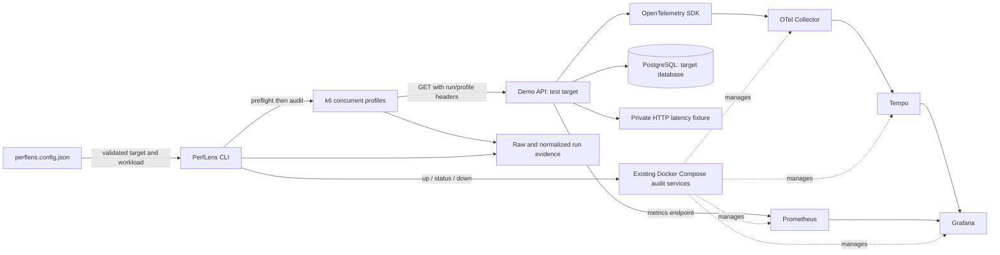

# PerfLens

**Backend Performance Audit CLI**

## 1. What is PerfLens?

PerfLens is a developer tool for diagnosing backend performance bottlenecks using observability, distributed tracing, metrics, and controlled load testing. The intended product is an installable CLI/toolkit that attaches to an existing backend project.

This repository is an early audit-toolkit foundation. The CLI controls local audit infrastructure and orchestrates bounded k6 audits. The NestJS application is a synthetic **test target**, separate from PerfLens itself. PerfLens supports evidence collection for performance auditing; it is not a SaaS or hosted observability platform.

## 2. What problem does it solve?

Engineering teams need evidence for four questions: Where is the backend slow? Why? What should we fix first? Did the change measurably help?

**Observe → Measure → Trace → Diagnose → Optimize → Verify**

Current Phase 2: **Load → Measure → Store Evidence**. Next Phase: **Evidence → Analyze → Identify Bottleneck**. PerfLens measures what happened under load. Automatic diagnosis, prioritized findings, reports, and before/after comparison are not implemented.

## 3. Current capabilities — Phases 1 and 2

- Executable `@perflens/cli` package with help, version, safe initialization, doctor, and infrastructure lifecycle commands.
- Local Collector, Tempo, Prometheus, and Grafana, using the original Compose definitions and persistent volumes.
- A project configuration describing the target backend, independently of its framework.
- An instrumented NestJS/PostgreSQL test target with normal order operations and explicitly intentional SQL, N+1, and HTTP dependency bottlenecks.
- Automatically provisioned Grafana datasources, HTTP/PostgreSQL traces, request/runtime metrics, and the existing k6 smoke baseline.
- Automated CLI tests and repeatable API/telemetry checks.
- `audit` with configurable, concurrent baseline/normal/peak/stress profiles; default baseline + normal only.
- Preflight, unique run directories, raw k6 evidence, normalized latency/throughput/error metrics, cancellation, and `runs` history.
- Run/profile request headers captured by the demo's OpenTelemetry server spans, plus telemetry time windows for later investigation.

## 4. Intended developer experience

The eventual installation and audit workflow is:

```sh
# FUTURE installation: package is not published
npm install -D @perflens/cli
npx perflens init
npx perflens doctor
npx perflens audit
```

Today, use a checkout with pnpm. `init`, `doctor`, and local `audit` exist; `analyze` and `report` do not. The package has a real `perflens` binary but remains private and unpublished. Infrastructure assets still live in this repository; installing the CLI alone does not instrument another backend or configure its scrape targets.

## 5. Architecture



Metrics are scraped directly from the target, not routed through Tempo or the Collector. The CLI has no NestJS imports or dependency on a running demo container. See [architecture](docs/architecture/architecture.md) for the current/future boundary.

## 6. CLI commands

| Command | Implemented behavior |
| --- | --- |
| `pnpm perflens --help` | List available commands |
| `pnpm perflens --version` | Print package version |
| `pnpm perflens init` | Create `perflens.config.json` and `.perflens/{runs,results,logs}` in the current directory; refuse to overwrite config |
| `pnpm perflens doctor` | Check config, Docker/Compose, local daemon, required files, loopback port mappings and port conflicts, plus readiness of existing services |
| `pnpm perflens infra up` | Start the four audit services and wait for health/readiness |
| `pnpm perflens infra status` | Report ready, running-but-not-ready, stopped, crashed, or absent services |
| `pnpm perflens infra down` | Stop only the four audit services; preserve their containers and volumes, and leave target services alone |
| `pnpm perflens audit` | Preflight, then baseline + normal; store measurements and correlation metadata |
| `pnpm perflens audit --profile baseline` | Run only the low-load profile |
| `pnpm perflens audit --profile normal` | Run only the normal concurrent profile |
| `pnpm perflens audit --profile peak,stress` | Explicitly select bounded higher-load profiles; local targets only |
| `pnpm perflens runs` | List this project's stored runs and statuses |

`--config <path>` selects config for doctor/audit/runs; otherwise these commands search the current directory and its parents. Run storage is relative to the config file's directory. `--infra-dir <path>` selects the PerfLens checkout; by default infrastructure resolves relative to the installed CLI. Infrastructure lifecycle commands deliberately do not need valid target configuration, so a config error cannot block shutdown.

Exit codes: `0` completed execution; `1` failed prerequisite, readiness, subprocess, or evidence check; `2` invalid arguments/config; `130` cancelled audit. Doctor returns `1` when any check fails. Measured HTTP failures are recorded in a completed audit; no performance SLO is invented. A successfully inspected stopped stack is not an error; unhealthy/crashed services are.

The executable can also be invoked directly, including from another target directory:

```sh
/absolute/path/to/PerfLens/packages/cli/bin/perflens.cjs --help
/absolute/path/to/PerfLens/packages/cli/bin/perflens.cjs init
/absolute/path/to/PerfLens/packages/cli/bin/perflens.cjs --infra-dir /absolute/path/to/PerfLens doctor
```

## 7. Quick start

Prerequisites: a running local Docker engine, Docker Compose v2 with `up --wait` support, Node.js 24 LTS, pnpm 10.12.4, and **host k6 2.3.x on PATH** for `audit`. The structured-summary adapter is verified against that k6 series. Install the matching binary using the [official k6 installation instructions](https://grafana.com/docs/k6/latest/set-up/install-k6/) or [release assets](https://github.com/grafana/k6/releases/tag/v2.3.0), then check `k6 version`. Other versions fail preflight explicitly. First installation/image pulls require network access.

From this repository root:

```sh
pnpm install
# Root postinstall builds the CLI. This also builds/checks the demo:
pnpm build
cp .env.example .env # Fresh clone only; preserve an existing .env
pnpm perflens --help
pnpm perflens doctor
pnpm perflens infra up

# Explicitly start the test target and its database:
docker compose up --build -d --wait demo-api
curl --fail http://localhost:3002/health
curl --fail http://localhost:3002/orders

pnpm perflens audit
pnpm perflens runs
pnpm perflens infra status
```

The tracked demo config and `.env.example` now agree on API host port `3002`; Grafana uses `3001`, Prometheus `9090`. Preserve an existing `.env` and align `target.baseUrl` if its API port differs. The Docker-internal API port remains `3000`.

Do not rerun `init` in this repository unless you intentionally removed the example config: it correctly refuses to overwrite it. There is no need to install Node on the host for the original all-in-one Docker demo workflow, but Node/pnpm are required for this source-checkout CLI.

## 8. PerfLens Doctor

```sh
pnpm perflens doctor
```

Doctor is read-only and does not start containers, contact the target application, install tools, or change source files. It checks:

- Valid local target configuration and required infrastructure files, including `.env`.
- Docker and Compose availability, local Docker endpoint, and daemon access.
- Rendered Compose configuration and loopback bindings for audit ports.
- Whether audit ports are free or already owned by the matching services in this Compose project.
- Readiness failures in already-running audit services.

A stopped or not-yet-created stack can pass doctor. A port occupied by another process fails with remediation. Doctor checks infrastructure ports; it does not reserve ports or preflight the separately managed target/database. Compose validation checks syntax/interpolation, not every service's configuration schema. Readiness validates running services; the original service-specific validator commands remain in the [demo reference](docs/demo-target.md).

If Docker is unreachable, start the local engine and ensure your user can access its socket. If a service is unhealthy, inspect `docker compose logs <service>` and run `pnpm perflens infra up`. Doctor does not silently downgrade failures to warnings.

`audit` adds execution preflight: validated endpoints/profiles, supported k6, all four ready infrastructure services, and a timed GET returning 2xx from every endpoint. No profile load starts when a critical check fails. Preflight GETs carry the run ID and `preflight` profile header; they are excluded from k6 measurements.

## 9. Starting infrastructure

```sh
pnpm perflens infra up
pnpm perflens infra status
```

The CLI starts **only Collector, Tempo, Prometheus, and Grafana**. It uses Compose healthchecks and checks Collector `/`, Tempo `/ready`, Prometheus `/-/ready`, and Grafana `/api/health`. Internal probes run using the `wget` already present in the Prometheus container. No test-target container, new helper service, or public Collector/Tempo port is needed.

`up` waits for Compose readiness and then retries endpoint checks for up to two minutes. A successful container start alone is not success. First image pulls can take several minutes. Prometheus can be ready while its demo scrape target is DOWN if the demo has not been started; this is expected.

- Grafana: http://localhost:3001/explore
- Prometheus: http://localhost:9090

To stop the audit infrastructure:

```sh
pnpm perflens infra down
pnpm perflens infra status
```

This preserves volumes **and containers** and leaves the demo API/PostgreSQL running. Stop the test target separately if finished:

```sh
docker compose stop demo-api postgres
```

Keeping an instrumented target running while the Collector is stopped can produce expected exporter connection errors. Existing `docker compose up --build` / `docker compose down` commands remain available for the full six-service demo. The CLI never invokes destructive volume cleanup. If you edit a bind-mounted service config while it is running, restart that service explicitly; `up` does not force-recreate healthy unchanged containers.

## 10. Demo application

`apps/demo-api` is a NestJS/PostgreSQL test target only. The schema, deterministic seed, HTTP/pg instrumentation, normal operations, and bottlenecks are preserved. On first start it seeds 2,000 customers, 500 products, 20,000 orders, and 80,000 items. Later starts preserve data.

| Endpoint | Purpose |
| --- | --- |
| `GET /` | Service/endpoint index |
| `GET /health` | Includes a database readiness query |
| `GET /orders` | Bounded pagination; default 20 orders |
| `GET /orders/:id` | Order/customer/item detail |
| `POST /orders` | Validated transactional order creation |
| `GET /performance/slow-query` | Intentional correlated item scans caused by an index-defeating cast |
| `GET /performance/n-plus-one` | Intentional list query plus 20 sequential item queries |
| `GET /performance/external-call` | Real HTTP call to a private fixture with a configured 750 ms delay |
| `GET /metrics` | Request counters, duration histogram, Node/process metrics |

Normal endpoints do not contain intentionally inefficient code. See the [demo target reference](docs/demo-target.md) for request payloads, validation limits, seeding, and debugging details.

## 11. Viewing traces

Generate traffic with an audit or individually:

```sh
pnpm perflens audit --profile baseline
curl --fail http://localhost:3002/orders/1
curl --fail http://localhost:3002/performance/slow-query
curl --fail http://localhost:3002/performance/n-plus-one
curl --fail http://localhost:3002/performance/external-call
```

Open Grafana Explore at http://localhost:3001/explore, choose **Tempo**, select **Last 15 minutes**, and run this TraceQL query in the code editor:

```traceql
{ resource.service.name = "perflens-demo-api" }
```

Allow several seconds for batching, then inspect a trace's waterfall. Expect PostgreSQL child spans; the N+1 example has **21 SQL queries**, plus pool spans. The external-call trace includes the outbound HTTP span and nested fixture server span. The slow-query example concentrates database work in one query. These are trace structure observations, not benchmark results.

For fresh demo traces only:

```traceql
{ resource.service.name = "perflens-demo-api" && span.url.path =~ "/performance/.*" }
```

For a specific audit, copy the exact TraceQL query from its `telemetry/metadata.json`:

```traceql
{ resource.service.name = "perflens-demo-api" && span.perflens.audit.run_id = "<run-id>" }
```

Add `&& span.perflens.audit.profile = "normal"` inside the braces to narrow to a profile. The run header is metadata, not an OpenTelemetry trace ID. The CLI never generates trace IDs or modifies trace propagation. Other target applications must explicitly capture the documented headers as attributes; no automatic source modification occurs.

## 12. Viewing metrics

After starting the demo, open http://localhost:9090/targets and confirm `demo-api` is UP. In Grafana Explore select **Prometheus**, generate traffic, and allow at least two five-second scrapes.

```promql
# Requests/sec
sum by (route) (rate(perflens_http_requests_total[1m]))

# p95 latency in seconds
histogram_quantile(0.95, sum by (le, route) (rate(perflens_http_request_duration_seconds_bucket[1m])))

# 5xx ratio; zero if no 5xx series exists
(sum(rate(perflens_http_requests_total{status_code=~"5.."}[1m])) or vector(0))
/ clamp_min(sum(rate(perflens_http_requests_total[1m])), 0.000001)
```

The target's independent Prometheus registry remains the metrics source. OpenTelemetry has `metricReaders: []`, avoiding an unintended OTLP metrics export to the traces-only Collector.

Audit metadata stores UTC run/profile windows and target/service identity for querying metrics later. Run IDs are deliberately absent from Prometheus labels to avoid unbounded cardinality. Windows do not isolate audit traffic from other traffic on the same service. Phase 2 does not take metric snapshots or implement a Prometheus analysis engine.

## 13. Running the existing baseline test

With host k6:

```sh
k6 run -e BASE_URL=http://localhost:3002 load-tests/baseline.js
```

Or use the existing Docker network, independent of the published API port:

```sh
docker run --rm -i --network perflens_default \
  -e BASE_URL=http://demo-api:3000 \
  grafana/k6:2.3.0 run - < load-tests/baseline.js
```

This unchanged Phase 1 script remains a separate manual smoke test: five VUs, 30 seconds, one-second pacing. It does not establish a throughput ceiling or SLO. Run it only against an authorized target.

For standardized Phase 2 evidence, use:

```sh
pnpm perflens audit                         # baseline + normal only
pnpm perflens audit --profile baseline
pnpm perflens audit --profile normal
pnpm perflens audit --profile baseline,normal
pnpm perflens runs
```

Each run stores `run.json`, a resolved `config.json`, `raw/` k6 summaries and samples, `results/<profile>.json`, `telemetry/metadata.json`, and logs under `.perflens/runs/<run-id>/`. Profile summaries include request counts, errors, RPS, and p50/p95/p99. Failed and cancelled runs retain available evidence. See [audit methodology](docs/audit-methodology.md) for metric definitions, safety bounds, and artifact contracts.

## 14. Repository structure

```text
perflens/
├── packages/cli/                 # PerfLens product CLI
│   ├── bin/perflens.cjs          # Executable entry point
│   ├── assets/audit.js           # Packaged, bounded k6 workload
│   ├── src/
│   │   ├── index.ts              # Commander setup and top-level errors
│   │   ├── commands/             # Thin command orchestration
│   │   ├── config/               # Project parsing, validation, initialization
│   │   ├── audit/                # Preflight, k6 runner, normalization, run storage
│   │   ├── services/             # Doctor, Docker/Compose, ports, readiness
│   │   └── utils/                # User-facing errors
│   └── test/                     # CLI and service behavior tests
├── apps/demo-api/                # Test target, not a CLI dependency
├── infra/                       # Existing four audit-service configurations
├── load-tests/baseline.js        # Existing manual k6 smoke test
├── docs/
│   ├── architecture/            # Current/future design, decisions, verification
│   ├── audit-methodology.md      # Profiles, metrics, evidence, and safety contract
│   └── demo-target.md           # Detailed test-target reference
├── .perflens/                   # Ignored generated working area, created by init
│   ├── runs/
│   ├── results/
│   └── logs/
├── perflens.config.json          # Tracked example target configuration
├── docker-compose.yml           # Single source of infrastructure definitions
├── .env.example                 # Local Compose settings
├── pnpm-workspace.yaml
└── pnpm-lock.yaml
```

Generated `.perflens` contents are ignored; user config stays outside that directory. Run records are local filesystem artifacts. No findings database or reports are generated.

## 15. Configuration

One format: **JSON**. It needs no YAML parser dependency and supports strict validation with clear errors. The deliberately small schema is:

```json
{
  "project": { "name": "demo-api" },
  "target": { "baseUrl": "http://localhost:3002" },
  "observability": { "serviceName": "perflens-demo-api" },
  "audit": {
    "endpoints": [{ "method": "GET", "path": "/orders" }],
    "timeoutMs": 5000,
    "profiles": {
      "baseline": { "vus": 1, "duration": "10s", "paceMs": 500 },
      "normal": { "vus": 3, "duration": "15s", "paceMs": 500 },
      "peak": { "vus": 6, "duration": "15s", "paceMs": 500 },
      "stress": { "vus": 10, "duration": "15s", "paceMs": 500 }
    }
  }
}
```

Doctor validates all three fields and rejects unknown keys. Names use letters, digits, dots, underscores, or hyphens. Target URLs must use HTTP(S) and a loopback host (`localhost`, `127.0.0.1`, or `[::1]`), with no embedded credentials, query, or fragment. No cloud or secret fields exist.

`audit` uses this target and workload, but does not rewrite instrumentation, change Compose ports, or configure Prometheus scrape targets. The actual demo service name is set in `.env`; keep it aligned. Old Phase 1 configs without `audit` remain valid for doctor; `audit` asks for explicit endpoints. Omitted profile fields use the defaults above. New `init` configs use a generic `http://localhost:3000` and GET `/`; edit both for your target before auditing.

Limits: 1–8 unique GET paths, 1–50 VUs, 1–120 whole seconds per profile, 250–5000 ms minimum start interval per VU, and 100–15000 ms request timeout. Paths cannot contain queries, fragments, encoding, or dot segments. Headers, auth, bodies, and non-GET methods are not supported. Profiles run sequentially in baseline/normal/peak/stress order; peak/stress always require explicit selection. All effective settings are stored. These small defaults are examples, not assertions about production traffic.

`init` creates only the config and generated-directory convention. It does not change `package.json`, `.gitignore`, application code, dependencies, or Docker files. For an external target repository, manually ignore `.perflens/` before audit generates artifacts. If install scripts are disabled, run `pnpm --filter @perflens/cli build` before using the CLI.

## 16. Safety model

- Audit services bind host ports to loopback; CLI infrastructure operations reject non-local Docker endpoints and non-loopback audit port mappings.
- The CLI sends no application telemetry to third-party services. Existing trace and metric paths stay on the local Docker network. Grafana/Tempo usage reporting and Grafana automatic plugin/update/public-key retrieval are disabled.
- Package installation and Docker image pulls still contact their registries explicitly. This is not an air-gap or an egress firewall; locally installed third-party software and user-initiated browser/plugin actions remain outside the CLI's control.
- Audit only systems you are authorized to test; prefer isolated development/staging environments. CLI audits retain the Phase 1 **loopback-only** restriction. Remote URLs are rejected even for baseline, with no override or implicit CI approval.
- Bounded concurrent GET profiles, timeouts, per-VU pacing, explicit peak/stress selection, no redirects, and one active audit per config directory. No infinite tests or automatic stress escalation.
- No automatic source edits, instrumentation installation, database operations, optimization, or production load testing. GET is not proof of a side-effect-free endpoint; choose appropriate targets explicitly.
- k6 receives an allowlisted environment, empty options config, no cloud/export destination, disabled usage reporting, and discarded response bodies. No request bodies, Authorization headers, or credentials are accepted or persisted. Do not put secrets in names or paths.
- Ctrl+C stops the child, waits for exit, preserves partial evidence, and returns 130. Process deadlines terminate hung load generation. Hard kill/host crash cannot guarantee finalization; inspect processes before removing a stale project lock.
- `infra down` stops only the four named audit services and never deletes persistent volumes or the target database.
- CLI process execution uses argument arrays without a shell. It does not accept arbitrary Compose passthrough flags or print rendered Compose configuration containing credentials.
- Credentials stay in ignored `.env`. The sample password is disposable local development data. No secrets belong in project config.

Grafana has anonymous local Editor access for Explore; this is not production access control. Do not expose this demo stack publicly. The target intentionally contains expensive endpoints, synthetic data, and 100% trace sampling. Tempo retention is 24 hours; Prometheus retention is seven days.

## 17. Current limitations

- Checkout-based infrastructure assets and one local Compose project; no published installer or multi-project isolation.
- Target configuration drives GET workloads; instrumentation and Prometheus scrape setup for other applications remain manual.
- Host k6 2.3.x is required for audit; the original Docker baseline remains available separately. No remote-target opt-in, auth, request bodies, fixed arrival-rate executor, or distributed load generation.
- Normalized latency is aggregated across configured endpoints. Status/count breakdowns and raw samples are retained. Client overlap estimates have millisecond precision; stored server traces can independently verify overlap.
- Trace data remains in Tempo, subject to retention, rather than embedded in runs; metric windows can include unrelated traffic. No automatic trace/metric analytics or snapshot collection.
- Framework-independent CLI; only the existing NestJS test target is instrumented today.
- Infrastructure readiness does not imply target readiness, trace ingestion, or useful metrics; the separate telemetry verification checks those paths.
- No automated analysis, P0/P1/P2 findings, reporting, or before/after comparison.
- No report formats, GUI/dashboard product, cloud deployment, or CI publishing.

Verification commands:

```sh
pnpm build
pnpm typecheck
pnpm test
BASE_URL=http://localhost:3002 pnpm test:smoke
# Wait several seconds after generating demo traffic:
docker compose exec -T demo-api node --input-type=module < apps/demo-api/test/telemetry.mjs
# Replace the run ID after auditing the four demo endpoints:
docker compose exec -T -e AUDIT_RUN_ID='<run-id>' -e EXPECT_DEMOS=true demo-api node --input-type=module < apps/demo-api/test/audit-telemetry.mjs
docker compose config --quiet
```

No separate linter is configured. See the [verification record](docs/architecture/verification.md) for actual outcomes and failures encountered.

## 18. Roadmap

1. **Phase 1 — CLI/toolkit foundation:** safe config/init, doctor, local infrastructure lifecycle, preserved instrumented demo and smoke baseline.
2. **Phase 2 — standardized audit execution:** bounded concurrent k6 profiles, preflight, measured performance, raw/normalized evidence, and telemetry correlation.
3. **Next Phase 3 — evidence analysis:** consume stored evidence and correlated telemetry to investigate bottlenecks. Findings/reporting require explicit future work; no heuristics or report generation are implemented now.
4. **Later — additional framework/language integrations:** Node, Python, Java, Go, .NET, based on validated integration contracts.
5. **Only after real client validation:** evaluate whether any hosted/product features are warranted.

Phase 3 and future analysis/integration/reporting components are **not implemented** here.
