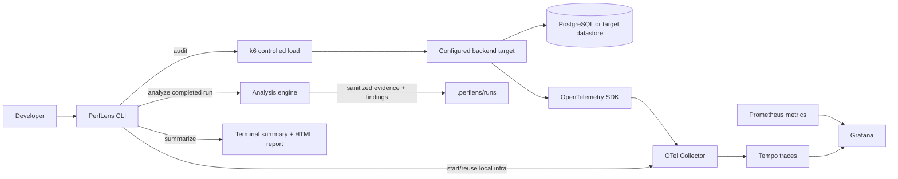

# PerfLens

## Backend Performance Audit CLI

PerfLens is an installable developer toolkit for measuring backend performance under controlled local load, correlating results with OpenTelemetry traces, identifying evidence-backed bottlenecks, and generating an audit report. Install it into the backend you want to test; the PerfLens monorepo and reference applications are not required at runtime.

## What problem does it solve?

PerfLens supports an evidence-first audit workflow:

```text
Observe → Load → Measure → Trace → Analyze → Identify likely bottlenecks
```

The audit command records what happened. The analysis command looks for specific measured patterns and explains the evidence behind each finding. A latency change alone is never attributed to a database or dependency.

## Current capabilities

- Installable `@perflens/cli` with project-local infrastructure assets and a framework-neutral audit command.
- Docker-based OpenTelemetry Collector, Tempo, Prometheus, and Grafana, provisioned by the installed CLI.
- k6-based bounded, concurrent profiles and immutable run directories.
- Run/profile correlation headers for targets that capture the documented OpenTelemetry attributes.
- Deterministic analysis of completed results and sanitized, correlated traces; Markdown and HTML audit reports from persisted findings.
- Two separate Node.js reference targets: NestJS and Express. Each has normal routes and isolated intentional slow-query, repeated-query, and external-call examples.

The reference apps are integrations/test targets, not the PerfLens product or analysis architecture. The shared `@perflens/node-instrumentation` workspace package provides generic HTTP/PostgreSQL instrumentation and the PerfLens correlation contract. Express opts into its OpenTelemetry layer instrumentation. Only NestJS and Express are verified; other Node.js frameworks are not claimed as supported.

Phase 3 analysis currently supports measured latency, error-rate, and throughput changes across comparable profiles, database time contribution, repeated database operation patterns, recurring slow database operations, and recurring external HTTP latency. Profile comparison uses VUs only for the supported constant-VU model when endpoint, pacing, timeout, and test semantics match; otherwise it skips the comparison. Repeated-query detection is separate from impact severity, and dependency contribution is aggregated per request. Phase 4 formats saved findings as Markdown and HTML; it performs no new diagnosis or recommendations. See [analysis methodology](docs/analysis-methodology.md) and [reporting](docs/reporting.md).

## Intended workflow

The normal consumer workflow is `npm install -D @perflens/cli` followed by `npx perflens audit`. On first interactive use, audit asks for a local target and known safe GET paths; automatic Express route discovery is not currently reliable, so PerfLens will not claim to discover routes. For multiple configured endpoints it lists every endpoint and requires interactive approval before load; non-interactive runs require `--yes`. `npx perflens init` remains available for explicit setup. For Express, initialize PerfLens instrumentation before Express and database modules as described in [the consumer integration guide](docs/integrations/express.md).

## Architecture



## CLI commands

```sh
npx perflens --help
npx perflens --version
npx perflens init
npx perflens doctor
npx perflens audit
npx perflens audit --profile baseline,normal
npx perflens runs
npx perflens analyze <run-id> --offline
npx perflens report <run-id> --format markdown
npx perflens infra status
npx perflens infra down
```

`npx perflens audit` validates the configured loopback target, starts missing local audit infrastructure while reusing services already running for that project, runs the configured bounded profiles, analyzes correlated Tempo evidence, and generates all report formats. It prints actual profile measurements, Phase 3 findings, trace counts, Grafana access, and the HTML report path. If telemetry is missing, analysis fails explicitly and keeps the measured run artifacts for review.

Advanced commands remain separate: `analyze` selects the latest completed run by default, snapshots sanitized traces from local Tempo once, and supports offline reruns. `report` consumes saved analysis only and writes `report.json`, `report.md`, and `report.html` under `.perflens/runs/<run-id>/report/`; it never starts a load test or analysis.

## Quick start

Prerequisites: Node.js 22.12+, Docker with a local daemon and Docker Compose, plus k6 2.3.x on `PATH` for audits. The installed tool binds infrastructure to loopback and retains data in local named volumes.

```sh
npm install -D @perflens/cli
# Instrument your app using docs/integrations/express.md, then start it.
npx perflens audit
```

On the first interactive audit, PerfLens asks for the local API URL, then whether you want recommended safe GET routes, multiple known routes, or one route. Because general Express route discovery is not reliable, it asks for paths instead of pretending to inspect your router. It creates `perflens.config.json`, appends `.perflens/` to `.gitignore` without replacing existing content, and stores generated runtime assets, run evidence, and reports under `.perflens/`. Existing valid configuration is reused without prompting or rewriting. No application source or dependencies are modified. Multiple endpoints require approval showing the exact GET paths and profiles before any load starts; `--yes` is the explicit non-interactive authorization. Health and metrics routes are excluded, and only GET can be configured for automatic load.

Before load, PerfLens uses configured `target.headers` for target preflight and verifies a correlated application trace. Private endpoints can use environment references such as `"Authorization": "Bearer ${PERFLENS_AUTH_TOKEN}"` in config; export the token in the shell before running the command. Secret values are resolved in memory and are not written to run artifacts. A 401/403 stops the audit before load and explicitly reports that analysis and report generation did not occur. PerfLens does not automatically instrument a running app: follow the Express guide and restart the app with its instrumentation preloaded. For a containerized application, `localhost` inside that container is not the host; configure networking so the app can reach the selected local OTLP receiver, or run the app on the host. PerfLens does not edit the app's Compose configuration. In non-interactive use, create config before the audit; PerfLens will not guess target routes. `perflens init` remains optional explicit setup. The Node instrumentation package reads the selected project-local OTLP port and configures `OTEL_EXPORTER_OTLP_TRACES_ENDPOINT` before creating its exporter. `perflens infra down` stops only PerfLens's four audit services; persistent volumes and your application remain running.

### Local URLs

| Service | URL |
| --- | --- |
| Example local target | `http://localhost:3000` (set during init) |
| Grafana | `http://localhost:3001` (actual selected URL is printed) |
| Prometheus | `http://localhost:9090` (actual selected URL is printed) |
| Tempo query API | `http://localhost:3200` (actual selected URL is printed) |
| OTLP HTTP receiver | Selected loopback endpoint is printed by init, doctor, infra up, and audit; the Node bootstrap configures it automatically. |

Grafana provisions the **PerfLens — Local API Performance** dashboard with request rate, 4xx/5xx rate, and p50/p95/p99 latency queries over the standard `perflens_http_*` metrics. The dashboard has data only when the target exposes those metrics. In Grafana → Explore → Tempo, query the run using `{ resource.service.name = "<service-name>" && span.perflens.audit.run_id = "<run-id>" }`.

### Demo target endpoints

The separate NestJS demo API includes `GET /orders`, `GET /orders/:id`, `POST /orders`, and three explicitly intentional performance fixtures:

- `GET /performance/slow-query` runs an intentionally inefficient PostgreSQL query.
- `GET /performance/n-plus-one` loads orders followed by repeated item queries (21 PostgreSQL query spans per request in the fixture).
- `GET /performance/external-call` calls the local 750 ms dependency simulator.

These fixtures are for controlled local audits. They are not PerfLens features and the analysis engine does not use endpoint names to decide findings.

### Express reference target

The Express application is an independent, opt-in reference target. Start it after `perflens infra up`:

```sh
docker compose --profile express up -d --build express-demo-api
curl http://localhost:3003/health
pnpm perflens --config apps/express-demo-api/perflens.config.json audit --profile baseline,normal
pnpm perflens --config apps/express-demo-api/perflens.config.json analyze
pnpm perflens --config apps/express-demo-api/perflens.config.json report
```

It reuses PostgreSQL and the current Collector/Tempo/Prometheus/Grafana stack. Its `/orders` route is a single clean bounded read; the `/performance/*` routes are documented intentional fixtures. Full setup, correlation, and privacy details are in [the Express integration guide](docs/integrations/express.md).

### Inspect traces and metrics

Run an audit, copy its printed run ID, then open Grafana → Explore → Tempo and query:

```traceql
{ resource.service.name = "perflens-demo-api" && span.perflens.audit.run_id = "<run-id>" }
```

Both targets use the shared Node instrumentation bootstrap to capture valid `X-PerfLens-Run-Id` and `X-PerfLens-Profile` values as span attributes. Open a server request span to inspect child PostgreSQL or HTTP client spans. PerfLens analysis uses the same run/profile correlation and saves the sanitized spans it examined.

Prometheus scrapes both reference APIs' `perflens_http_requests_total` and `perflens_http_request_duration_seconds` metrics. Try `perflens_http_requests_total` or `histogram_quantile(0.95, sum by (le) (rate(perflens_http_request_duration_seconds_bucket[5m])))` in Prometheus or Grafana Explore. These live dashboard queries are not persisted as per-run metric snapshots in this phase.

### Run the original Phase 1 smoke test

With the demo API running, the existing k6 script remains available independently of audit-run artifacts:

```sh
k6 run --env BASE_URL=http://localhost:3002 load-tests/baseline.js
```

It runs its existing 5-VU, 30-second smoke profile against `GET /orders`. For reproducible Phase 2 runs with saved evidence, use `pnpm perflens audit`; the safe default is baseline plus normal, while peak and stress require explicit selection.

## Configuration

The tracked `perflens.config.json` shows the minimal project, target, service identity, endpoints, and bounded profiles. Audit targets are currently loopback-only GET endpoints. Results aggregate metrics across configured endpoints; the Phase 3 comparison rule reports an endpoint-specific load finding only when exactly one endpoint was measured. Multi-endpoint trace rules use configured routes; a single endpoint is scoped by its run/profile correlation, including literal paths whose HTTP route is a parameterized template.

Each finalized run stores `run.json`, resolved `config.json`, raw k6 output, normalized profile results, and run/profile telemetry metadata in `.perflens/runs/<run-id>/`. Analysis adds:

```text
analysis/
├── evidence.json   # normalized results and sanitized Tempo span snapshot
├── findings.json   # structured, versioned findings
└── analysis.json   # complete deterministic analysis result
```

Artifacts contain no authorization headers, cookies, request bodies, raw SQL values, or external URL query strings. Directory/file permissions are restricted for newly written artifacts. The local working directory is ignored by this repository; projects embedding PerfLens should ignore `.perflens/` as well.

## Reading findings

Findings include stable rule IDs, category, target/profile, severity (`P0`/`P1`/`P2`), confidence (`high`/`medium`), supporting evidence, and measured values. The engine intentionally emits no low-confidence trace findings. In particular:

- Load degradation requires comparable completed profiles under the same `constant-vus` model, one identical endpoint, pacing, and timeout; it uses strictly increased configured VUs only within that model, at least 20 requests per profile, and a centralized material latency/error/throughput change threshold. A throughput decrease is observational, not proof of saturation or root cause.
- Trace rules require at least five correlated requests and consistent repeated evidence.
- PostgreSQL contribution uses the union of child-span time intervals clipped to the request span, so overlapping spans are not double counted.
- A repeated-query pattern can remain a P2 candidate when the measured database time contribution is small; repetition alone does not establish a major latency impact. External dependency severity uses per-request interval contribution rather than call-weighted durations.
- Similar query detection uses conservative literal-free SQL normalization. Without a safe query shape, it will not infer repetition from generic `SELECT` labels.
- CPU, memory, connection-pool saturation, index recommendations, and root-cause scoring are unsupported.

Severity thresholds are explicit local defaults, not universal SLOs. A result is an evidence-backed candidate for engineering review, not a guarantee about production behavior.

## Safety and privacy

PerfLens currently runs its observability stack locally and does not export telemetry to third-party services. Audits have bounded concurrency and duration, no background traffic, and loopback-only targets. Use a controlled test/staging service you are authorized to test; never assume permission to load-test a remote or production system. No automatic source edits, destructive database actions, or secret collection are performed.

## Repository layout

```text
apps/demo-api/              NestJS reference/test target
apps/express-demo-api/      Express reference/test target
packages/node-instrumentation/ Shared generic Node.js OpenTelemetry bootstrap
packages/cli/                Executable PerfLens CLI and orchestration
packages/analysis-engine/    Framework-independent deterministic rules
packages/reporting/          Framework-independent JSON, Markdown, and HTML reports
infra/                       Existing local telemetry/metrics configuration
load-tests/                  Original Phase 1 k6 smoke test
docs/                        Architecture, methodology, verification records
docker-compose.yml            Local target and observability stack
```

## Limitations and roadmap

- **Phase 1 — Observe:** local telemetry infrastructure, demo target, and CLI control.
- **Phase 2 — Measure:** bounded concurrent audits and stored results.
- **Phase 3 — Analyze:** deterministic findings from measured load and correlated traces.
- **Phase 4 — Report:** client-readable Markdown and HTML from saved findings (current phase).
- **Phase 5 — Node.js integrations:** NestJS and Express reference targets use shared instrumentation and the same audit pipeline.

There is no automatic remediation, PDF report, before/after comparison, SaaS, authentication, billing, hosted dashboard, production stress mode, or support for other languages/frameworks. The trace query currently snapshots at most 500 traces per profile. Data beyond that cap is marked truncated and findings describe only the captured sample. Tempo retention is finite; analyze while traces remain available, then reruns can use the saved evidence offline.

See [architecture](docs/architecture/architecture.md), [analysis methodology](docs/analysis-methodology.md), [audit methodology](docs/audit-methodology.md), and [verification history](docs/architecture/verification.md).
