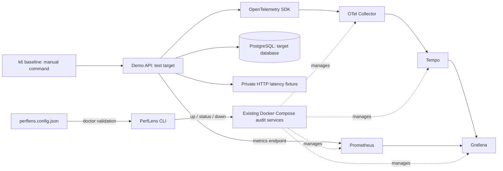

# PerfLens

**Backend Performance Audit CLI**

## 1. What is PerfLens?

PerfLens is a developer tool for diagnosing backend performance bottlenecks using observability, distributed tracing, metrics, and controlled load testing. The intended product is an installable CLI/toolkit that attaches to an existing backend project.

This repository is an early audit-toolkit foundation. The CLI now controls the existing local audit infrastructure. The NestJS application is a synthetic **test target**, not PerfLens itself. PerfLens can support a performance auditing service, but its product architecture is a developer tool—not a hosted observability platform or SaaS.

## 2. What problem does it solve?

Engineering teams need evidence for four questions: Where is the backend slow? Why? What should we fix first? Did the change measurably help?

**Observe → Measure → Trace → Diagnose → Optimize → Verify**

Phase 1 makes evidence collection and manual investigation reproducible. It does not automatically diagnose bottlenecks, prioritize findings, or produce reports.

## 3. Current Phase 1 capabilities

- Executable `@perflens/cli` package with help, version, safe initialization, doctor, and infrastructure lifecycle commands.
- Local Collector, Tempo, Prometheus, and Grafana, using the original Compose definitions and persistent volumes.
- A project configuration describing the target backend, independently of its framework.
- An instrumented NestJS/PostgreSQL test target with normal order operations and explicitly intentional SQL, N+1, and HTTP dependency bottlenecks.
- Automatically provisioned Grafana datasources, HTTP/PostgreSQL traces, request/runtime metrics, and the existing k6 smoke baseline.
- Automated CLI tests and repeatable API/telemetry checks.

## 4. Intended developer experience

The eventual installation and audit workflow is:

```sh
# FUTURE: not published or fully implemented
npm install -D @perflens/cli
npx perflens init
npx perflens doctor
npx perflens audit
```

Today, use a checkout with pnpm. `init` and `doctor` exist; `audit`, `analyze`, and `report` do not. The package has a real `perflens` binary but remains private and unpublished. Infrastructure assets still live in this repository; installing the CLI alone does not install or configure another backend.

## 5. Architecture



Metrics are scraped directly from the target, not routed through Tempo or the Collector. The CLI has no NestJS imports or dependency on a running demo container. See [architecture](docs/architecture/architecture.md) for the current/future boundary.

## 6. CLI commands

| Command | Implemented behavior |
| --- | --- |
| `pnpm perflens --help` | List available commands |
| `pnpm perflens --version` | Print package version |
| `pnpm perflens init` | Create `perflens.config.json` and `.perflens/{runs,results,logs}` in the current directory; refuse to overwrite config |
| `pnpm perflens doctor` | Check config, Docker/Compose, local daemon, required files, loopback port mappings and port conflicts, plus readiness of existing services |
| `pnpm perflens infra up` | Start the four audit services and wait for health/readiness |
| `pnpm perflens infra status` | Report ready, running-but-not-ready, stopped, crashed, or absent services |
| `pnpm perflens infra down` | Stop only the four audit services; preserve their containers and volumes, and leave target services alone |

`--config <path>` selects the project config for doctor; otherwise doctor searches the current directory and its parents. `--infra-dir <path>` selects the PerfLens checkout; by default the CLI resolves the checkout relative to its installed location, not the target working directory. Infrastructure lifecycle commands deliberately do not need valid target configuration, so a target config error cannot block shutdown.

Exit codes: `0` success; `1` failed prerequisite, Docker operation, readiness, or runtime check; `2` invalid command/arguments or config errors outside doctor's aggregated checks. Doctor returns `1` when any check fails. A successfully inspected stopped stack is not an error; unhealthy/crashed services are.

The executable can also be invoked directly, including from another target directory:

```sh
/absolute/path/to/PerfLens/packages/cli/bin/perflens.cjs --help
/absolute/path/to/PerfLens/packages/cli/bin/perflens.cjs init
/absolute/path/to/PerfLens/packages/cli/bin/perflens.cjs --infra-dir /absolute/path/to/PerfLens doctor
```

## 7. Quick start

Prerequisites: a running local Docker engine, Docker Compose v2 with `up --wait` support, Node.js 24 LTS, and pnpm 10.12.4. First installation/image pulls require network access.

From this repository root:

```sh
pnpm install
# Root postinstall builds the CLI. This also builds/checks the demo:
pnpm build
cp .env.example .env # Fresh clone only; preserve an existing .env
pnpm perflens --help
pnpm perflens doctor
pnpm perflens infra up

# Explicitly start the test target and its database:
docker compose up --build -d --wait demo-api
curl --fail http://localhost:3000/health
curl --fail http://localhost:3000/orders

pnpm perflens infra status
```

Default host ports are API `3000`, Grafana `3001`, and Prometheus `9090`. This development workspace already uses API port `3002` because `3000` was occupied. If using that existing `.env`, use `http://localhost:3002` in host-side commands and adjust `target.baseUrl` to match when configuring your target. The Docker-internal API port remains `3000`.

Do not rerun `init` in this repository unless you intentionally removed the example config: it correctly refuses to overwrite it. There is no need to install Node on the host for the original all-in-one Docker demo workflow, but Node/pnpm are required for this source-checkout CLI.

## 8. PerfLens Doctor

```sh
pnpm perflens doctor
```

Doctor is read-only and does not start containers, contact the target application, install tools, or change source files. It checks:

- Valid local target configuration and required infrastructure files, including `.env`.
- Docker and Compose availability, local Docker endpoint, and daemon access.
- Rendered Compose configuration and loopback bindings for audit ports.
- Whether audit ports are free or already owned by the matching services in this Compose project.
- Readiness failures in already-running audit services.

A stopped or not-yet-created stack can pass doctor. A port occupied by another process fails with remediation. Doctor checks infrastructure ports; it does not reserve ports or preflight the separately managed target/database. Compose validation checks syntax/interpolation, not every service's configuration schema. Readiness validates running services; the original service-specific validator commands remain in the [demo reference](docs/demo-target.md).

If Docker is unreachable, start the local engine and ensure your user can access its socket. If a service is unhealthy, inspect `docker compose logs <service>` and run `pnpm perflens infra up`. Doctor does not silently downgrade failures to warnings.

## 9. Starting infrastructure

```sh
pnpm perflens infra up
pnpm perflens infra status
```

The CLI starts **only Collector, Tempo, Prometheus, and Grafana**. It uses Compose healthchecks and checks Collector `/`, Tempo `/ready`, Prometheus `/-/ready`, and Grafana `/api/health`. Internal probes run using the `wget` already present in the Prometheus container. No test-target container, new helper service, or public Collector/Tempo port is needed.

`up` waits for Compose readiness and then retries endpoint checks for up to two minutes. A successful container start alone is not success. First image pulls can take several minutes. Prometheus can be ready while its demo scrape target is DOWN if the demo has not been started; this is expected.

- Grafana: http://localhost:3001/explore
- Prometheus: http://localhost:9090

To stop the audit infrastructure:

```sh
pnpm perflens infra down
pnpm perflens infra status
```

This preserves volumes **and containers** and leaves the demo API/PostgreSQL running. Stop the test target separately if finished:

```sh
docker compose stop demo-api postgres
```

Keeping an instrumented target running while the Collector is stopped can produce expected exporter connection errors. Existing `docker compose up --build` / `docker compose down` commands remain available for the full six-service demo. The CLI never invokes destructive volume cleanup. If you edit a bind-mounted service config while it is running, restart that service explicitly; `up` does not force-recreate healthy unchanged containers.

## 10. Demo application

`apps/demo-api` is a NestJS/PostgreSQL test target only. The schema, deterministic seed, HTTP/pg instrumentation, normal operations, and bottlenecks are preserved. On first start it seeds 2,000 customers, 500 products, 20,000 orders, and 80,000 items. Later starts preserve data.

| Endpoint | Purpose |
| --- | --- |
| `GET /` | Service/endpoint index |
| `GET /health` | Includes a database readiness query |
| `GET /orders` | Bounded pagination; default 20 orders |
| `GET /orders/:id` | Order/customer/item detail |
| `POST /orders` | Validated transactional order creation |
| `GET /performance/slow-query` | Intentional correlated item scans caused by an index-defeating cast |
| `GET /performance/n-plus-one` | Intentional list query plus 20 sequential item queries |
| `GET /performance/external-call` | Real HTTP call to a private fixture with a configured 750 ms delay |
| `GET /metrics` | Request counters, duration histogram, Node/process metrics |

Normal endpoints do not contain intentionally inefficient code. See the [demo target reference](docs/demo-target.md) for request payloads, validation limits, seeding, and debugging details.

## 11. Viewing traces

Generate traffic (use port `3002` if configured):

```sh
curl --fail http://localhost:3000/orders/1
curl --fail http://localhost:3000/performance/slow-query
curl --fail http://localhost:3000/performance/n-plus-one
curl --fail http://localhost:3000/performance/external-call
```

Open Grafana Explore at http://localhost:3001/explore, choose **Tempo**, select **Last 15 minutes**, and run this TraceQL query in the code editor:

```traceql
{ resource.service.name = "perflens-demo-api" }
```

Allow several seconds for batching, then inspect a trace's waterfall. Expect PostgreSQL child spans; the N+1 example has **21 SQL queries**, plus pool spans. The external-call trace includes the outbound HTTP span and nested fixture server span. The slow-query example concentrates database work in one query. These are trace structure observations, not benchmark results.

For fresh demo traces only:

```traceql
{ resource.service.name = "perflens-demo-api" && span.url.path =~ "/performance/.*" }
```

## 12. Viewing metrics

After starting the demo, open http://localhost:9090/targets and confirm `demo-api` is UP. In Grafana Explore select **Prometheus**, generate traffic, and allow at least two five-second scrapes.

```promql
# Requests/sec
sum by (route) (rate(perflens_http_requests_total[1m]))

# p95 latency in seconds
histogram_quantile(0.95, sum by (le, route) (rate(perflens_http_request_duration_seconds_bucket[1m])))

# 5xx ratio; zero if no 5xx series exists
(sum(rate(perflens_http_requests_total{status_code=~"5.."}[1m])) or vector(0))
/ clamp_min(sum(rate(perflens_http_requests_total[1m])), 0.000001)
```

The target's independent Prometheus registry remains the metrics source. OpenTelemetry has `metricReaders: []`, avoiding an unintended OTLP metrics export to the traces-only Collector.

## 13. Running the existing baseline test

With host k6:

```sh
k6 run -e BASE_URL=http://localhost:3000 load-tests/baseline.js
```

Or use the existing Docker network, independent of the published API port:

```sh
docker run --rm -i --network perflens_default \
  -e BASE_URL=http://demo-api:3000 \
  grafana/k6:2.3.0 run - < load-tests/baseline.js
```

This remains a manual, local smoke baseline: five VUs, 30 seconds, one-second pacing. Read request duration, request failure rate, and `http_reqs` requests/sec. It does not establish a throughput ceiling or performance SLO. The CLI does not launch load tests in Phase 1; the existing standalone script accepts `BASE_URL`, so run it only against an explicitly authorized target.

## 14. Repository structure

```text
perflens/
├── packages/cli/                 # PerfLens product CLI
│   ├── bin/perflens.cjs          # Executable entry point
│   ├── src/
│   │   ├── index.ts              # Commander setup and top-level errors
│   │   ├── commands/             # Thin command orchestration
│   │   ├── config/               # Project parsing, validation, initialization
│   │   ├── services/             # Doctor, Docker/Compose, ports, readiness
│   │   └── utils/                # User-facing errors
│   └── test/                     # CLI and service behavior tests
├── apps/demo-api/                # Test target, not a CLI dependency
├── infra/                       # Existing four audit-service configurations
├── load-tests/baseline.js        # Existing manual k6 smoke test
├── docs/
│   ├── architecture/            # Current/future design, decisions, verification
│   └── demo-target.md           # Detailed test-target reference
├── .perflens/                   # Ignored generated working area, created by init
│   ├── runs/
│   ├── results/
│   └── logs/
├── perflens.config.json          # Tracked example target configuration
├── docker-compose.yml           # Single source of infrastructure definitions
├── .env.example                 # Local Compose settings
├── pnpm-workspace.yaml
└── pnpm-lock.yaml
```

Generated `.perflens` contents are ignored; project config stays outside that directory. No run records, findings, or reports are generated yet.

## 15. Configuration

One format: **JSON**. It needs no YAML parser dependency and supports strict validation with clear errors. The deliberately small schema is:

```json
{
  "project": { "name": "demo-api" },
  "target": { "baseUrl": "http://localhost:3000" },
  "observability": { "serviceName": "perflens-demo-api" }
}
```

Doctor validates all three fields and rejects unknown keys. Names use letters, digits, dots, underscores, or hyphens. Target URLs must use HTTP(S) and a loopback host (`localhost`, `127.0.0.1`, or `[::1]`), with no embedded credentials, query, or fragment. No cloud or secret fields exist.

These fields identify the future audit target; they do not currently rewrite instrumentation, change Compose ports, configure Prometheus scrape targets, or trigger network requests. The demo's actual service name is still set through `.env`. Keep it aligned with the project config. Config is validated, never executed as code.

`init` creates only the config and generated-directory convention. It does not change `package.json`, `.gitignore`, application code, dependencies, or Docker files. For an external target repository, manually ignore `.perflens/` before future commands start generating artifacts. If install scripts are disabled, run `pnpm --filter @perflens/cli build` before using the CLI.

## 16. Safety model

- Audit services bind host ports to loopback; CLI infrastructure operations reject non-local Docker endpoints and non-loopback audit port mappings.
- The CLI sends no application telemetry to third-party services. Existing trace and metric paths stay on the local Docker network. Grafana/Tempo usage reporting and Grafana automatic plugin/update/public-key retrieval are disabled.
- Package installation and Docker image pulls still contact their registries explicitly. This is not an air-gap or an egress firewall; locally installed third-party software and user-initiated browser/plugin actions remain outside the CLI's control.
- No automatic source edits, instrumentation installation, database operations, optimization, or production load testing.
- `infra down` stops only the four named audit services and never deletes persistent volumes or the target database.
- CLI process execution uses argument arrays without a shell. It does not accept arbitrary Compose passthrough flags or print rendered Compose configuration containing credentials.
- Credentials stay in ignored `.env`. The sample password is disposable local development data. No secrets belong in project config.

Grafana has anonymous local Editor access for Explore; this is not production access control. Do not expose this demo stack publicly. The target intentionally contains expensive endpoints, synthetic data, and 100% trace sampling. Tempo retention is 24 hours; Prometheus retention is seven days.

## 17. Current limitations

- Checkout-based infrastructure assets and one local Compose project; no published installer or multi-project isolation.
- Project metadata is not yet wired to instrumentation, scrape configuration, or workload execution for arbitrary backends.
- Framework-independent CLI; only the existing NestJS test target is instrumented today.
- Infrastructure readiness does not imply target readiness, trace ingestion, or useful metrics; the separate telemetry verification checks those paths.
- No automated analysis, P0/P1/P2 findings, reporting, or before/after comparison.
- No report formats, GUI/dashboard product, cloud deployment, or CI publishing.

Verification commands:

```sh
pnpm build
pnpm typecheck
pnpm test
BASE_URL=http://localhost:3000 pnpm test:smoke
# Wait several seconds after generating demo traffic:
docker compose exec -T demo-api node --input-type=module < apps/demo-api/test/telemetry.mjs
docker compose config --quiet
```

No separate linter is configured. See the [verification record](docs/architecture/verification.md) for actual outcomes and failures encountered.

## 18. Roadmap

1. **Phase 1 — CLI/toolkit foundation:** safe config/init, doctor, local infrastructure lifecycle, preserved instrumented demo and smoke baseline.
2. **Recommended Phase 2 — controlled audit runs:** explicit local workload configuration, reproducible run IDs/artifacts, and a bounded `audit` command orchestrating the established baseline methodology. Define authorization and failure behavior before executing tests.
3. **Later — analysis and reporting:** evidence-based P0/P1/P2 findings, then audit reports and before/after comparisons.
4. **Later — additional framework/language integrations:** Node, Python, Java, Go, .NET, based on validated integration contracts.
5. **Only after real client validation:** evaluate whether any hosted/product features are warranted.

Phase 2 and all future analysis/integration/reporting components are **not implemented** here.
