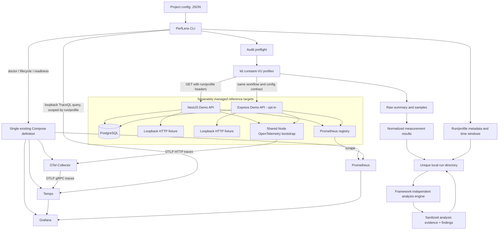
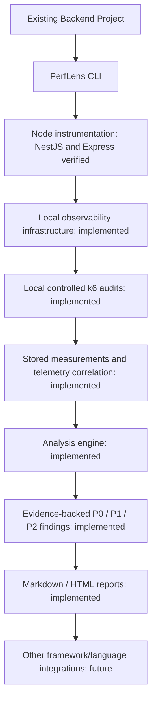

# PerfLens architecture

PerfLens is an installable Backend Performance Audit CLI / Developer Toolkit. The demo backends are test targets, not the product. The packed CLI validates consumer projects, provisions package-owned local infrastructure, runs bounded k6 audits, and coordinates deterministic analysis and reporting. It does not automatically rewrite application source.

## Preserved Phase 1, Phase 2, and Phase 3 — implemented

### Boundaries

- `packages/cli` owns command orchestration, project validation, subprocess execution, diagnostics, and readiness checks. Commander parses arguments; reusable functions/services handle operations.
- `apps/demo-api` owns the NestJS/TypeORM target; `apps/express-demo-api` owns a separate Express/pg target. Each has local fixture routes and neither is part of the CLI or analysis engine.
- `packages/node-instrumentation` owns shared NodeSDK resource/exporter/HTTP/PostgreSQL setup and bounded audit correlation. Express opts into `ExpressInstrumentation` before importing Express. The Compose profile reuses the existing database and telemetry services.
- The monorepo Compose stack remains for reference apps and regression acceptance. The CLI tarball separately includes a minimal local Collector/Tempo/Prometheus/Grafana Compose stack plus datasource/dashboard configuration; it does not depend on the consumer having a PerfLens checkout.
- Metrics flow directly from the target to Prometheus. Tempo stores traces, not the application's Prometheus metrics.
- `packages/cli/src/audit` owns bounded profile validation, preflight, child execution, k6 integration, normalization, and run storage. `packages/cli/src/analysis` retrieves correlated trace snapshots and renders results. `packages/analysis-engine` has no CLI, NestJS, TypeORM, or Express dependency.
- `.perflens/runs/<run-id>` stores measurements, analysis evidence/findings, and generated report files. Reports are rendered from persisted Phase 3 analysis without rediagnosis.

### Configuration and resolution

`perflens.config.json` contains `project.name`, `target.baseUrl`, `observability.serviceName`, and optional `audit` with endpoints, timeout, and profile overrides. JSON avoids executable config and an extra parser dependency. Strict validation rejects unknown keys, credential-bearing URLs, unsafe paths, unsupported methods, and out-of-bound workload values. Only loopback target URLs are permitted. Old Phase 1 configs remain valid for existing commands; auditing requires explicit endpoints. No credential fields exist; users must not put secrets in names/paths.

Doctor, audit, and runs find project config in the current directory or its parents, or accept `--config`. Artifacts are adjacent to that config. Package-owned templates resolve relative to the installed package and are copied into the consumer's `.perflens/infra`; the target config and run artifacts remain in the consumer project. `--infra-dir` can select an explicit compatible local Compose directory. The CLI build bundles the analysis/reporting modules, so the packed runtime has no workspace dependency.

`init` uses exclusive file creation and never overwrites existing configuration. It detects Express only from package metadata, inspects common entrypoints for the bootstrap symbol, and explains the early instrumentation import requirement. It does not write source or install dependencies. In interactive use it asks for the local target URL and a GET endpoint; non-interactive initialization uses `/health` as an editable example.

### Lifecycle and readiness

The infrastructure service allowlist is Collector, Tempo, Prometheus, and Grafana. `infra up` checks rendered Compose config and port conflicts, starts the allowlist using Compose health waits, then verifies service endpoints. The existing Prometheus image supplies `wget` for internal-network probes, avoiding a helper image or dependency on the demo. Tempo's query API is additionally published only on loopback so the independent CLI can collect correlated evidence.

`infra status` reports absent/stopped/running-not-ready/ready states and fails for crashed/unhealthy services. `infra down` uses `compose stop` only for the allowlist and verifies stopped states. It retains containers, networks, volumes, PostgreSQL, and target services. This deliberate meaning of `down` is documented in command help.

Doctor is read-only. Ports owned by the matching service in the selected Compose project count as correctly allocated; unrelated listeners are failures. The target API port and application health are separate from infrastructure readiness. Config rendering is never printed because it can contain `.env` credentials.

### Safety and network behavior

Shell-free argument arrays, local Docker checks, loopback bindings, bounded process timeouts, and nonzero errors form the preserved safety baseline. Audit adds bounded VUs/duration/request timeouts/pacing, explicit high-load selection, no redirects, and a project lock. Analysis only reads completed run artifacts and local Tempo, stores allowlisted sanitized spans, and does not mutate application or database state. Reporting formats persisted inputs and does no new diagnosis. Remote target URLs remain rejected without an override; CI cannot implicitly authorize remote load.

Packaged Grafana binds to loopback and uses local read-only anonymous access. The provisioned dashboard queries the documented `perflens_http_*` request and histogram metrics; it does not synthesize runtime, CPU, or database panels. Images and npm dependencies require registry access during installation/startup, but telemetry is configured only for the local stack.

### Audit execution and evidence boundaries

`audit` resolves config and profiles, exclusively allocates a UUID run, checks k6 2.3.x plus infrastructure readiness, and preflights each endpoint. The top-level command first reuses its healthy project-local infrastructure or starts it, then invokes the existing measurement service, analyzer, and reporter in sequence. Stage failures remain nonzero and preserve completed/partial run evidence; telemetry absence is an explicit failure. It then displays saved measurements and Phase 3 findings without adding diagnosis.

The k6 script executes concurrent constant-VU GET requests with pacing and explicit timeouts. It writes its structured summary and raw metric points. The parser produces schema-versioned counts, status distribution, error rate, RPS, percentiles, workload, and approximate client overlap evidence. It contains no root-cause rules. HTTP failures under load are measurements; subprocess/evidence failures make the run fail. Profiles and runs preserve partial status and available evidence.

`RunStore` uses exclusive run-directory creation, atomic state writes, and finalization. Later commands never resume or overwrite a completed directory. This is application-level immutability, not OS protection against file owners. Raw evidence stays local; filesystem history needs no database.

Both Node reference apps use the shared HTTP/PostgreSQL bootstrap. Server spans capture only valid, bounded audit run/profile headers; OpenTelemetry remains responsible for trace IDs and context propagation. Express adds its framework layer instrumentation. Analysis queries Tempo by service, run ID, profile, and profile UTC window, then stores normalized span evidence. The analysis rules depend on span kinds, semantic HTTP/database attributes, service identity, timing, and correlation—not NestJS or Express internals. Prometheus metric snapshots and resource-saturation findings remain unsupported because Phase 2 does not persist reliable per-run system metrics.

The full measurement contract is in [audit methodology](../audit-methodology.md); Phase 3 rules and thresholds are in [analysis methodology](../analysis-methodology.md); external Express setup is in [the integration guide](../integrations/express.md).

## Current-to-future workflow

`analyze` consumes validated run artifacts and correlated telemetry, rather than framework controllers or demo-specific SQL. `audit` currently targets local GET endpoints. Phase 5 verifies generic Node instrumentation with NestJS and Express reference targets. Other frameworks/languages and recommendations remain future work.

Analysis remains separate from audit execution; offline replay uses the saved evidence snapshot. Missing optional trace evidence is reported explicitly, and unsupported resource rules do not infer saturation from latency.
