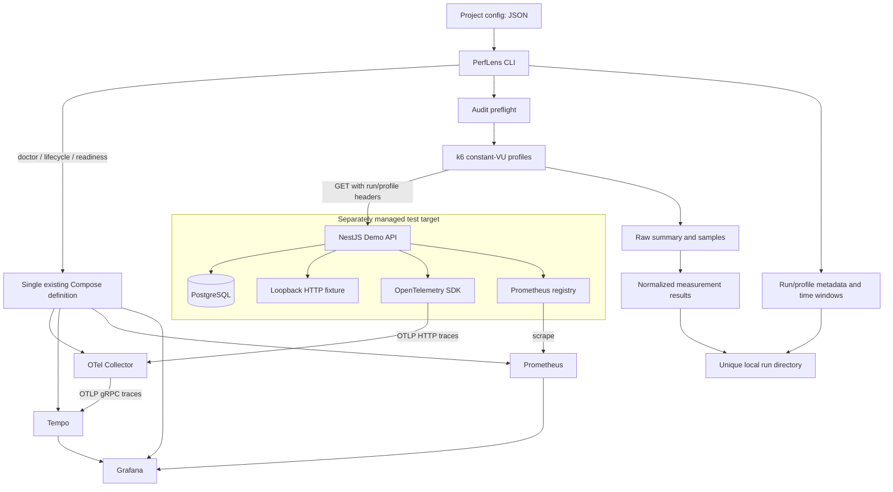
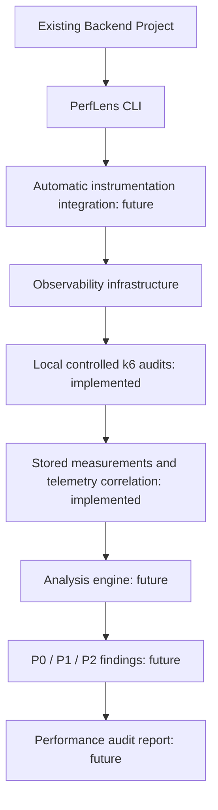

# PerfLens architecture

PerfLens is an installable Backend Performance Audit CLI / Developer Toolkit. This repository is its early, checkout-based foundation. The demo backend is a test target, not the product. The CLI controls infrastructure, validates projects, and runs bounded local k6 audits. It does not automatically instrument arbitrary applications or diagnose root causes.

## Preserved Phase 1 and current Phase 2 — implemented

### Boundaries

- `packages/cli` owns command orchestration, project validation, subprocess execution, diagnostics, and readiness checks. Commander parses arguments; reusable functions/services handle operations.
- `apps/demo-api` owns all NestJS/TypeORM code, migrations, synthetic seed data, and intentionally slow demo endpoints. The CLI does not import it, build it during `infra up`, or require it to probe infrastructure.
- `infra` and `docker-compose.yml` remain the only infrastructure definitions. No generated or duplicated Compose template is introduced.
- Metrics flow directly from the target to Prometheus. Tempo stores traces, not the application's Prometheus metrics.
- `packages/cli/src/audit` owns bounded profile validation, preflight, child execution, k6 integration, normalization, and run storage. Command handlers orchestrate services and cancellation; no command-specific shell parser is introduced.
- `.perflens/runs/<run-id>` holds current and historical evidence, raw data, normalized results, telemetry metadata, and logs. Top-level `results`/`logs` directories created by Phase 1 init remain reserved. No findings or reports are generated.

### Configuration and resolution

`perflens.config.json` contains `project.name`, `target.baseUrl`, `observability.serviceName`, and optional `audit` with endpoints, timeout, and profile overrides. JSON avoids executable config and an extra parser dependency. Strict validation rejects unknown keys, credential-bearing URLs, unsafe paths, unsupported methods, and out-of-bound workload values. Only loopback target URLs are permitted. Old Phase 1 configs remain valid for existing commands; auditing requires explicit endpoints. No credential fields exist; users must not put secrets in names/paths.

Doctor, audit, and runs find project config in the current directory or its parents, or accept `--config`. Artifacts are adjacent to that config. Infrastructure resolves relative to the CLI's checkout or explicit `--infra-dir`. This separates the target directory from the toolkit's infrastructure location. A future distributable needs an infrastructure asset/version strategy; the current package only bundles its own k6 script, not the infrastructure.

`init` uses exclusive file creation and never overwrites existing configuration. It creates no instrumentation, dependency changes, Git edits, Docker changes, or framework guesses. All target integration remains explicit.

### Lifecycle and readiness

The infrastructure service allowlist is Collector, Tempo, Prometheus, and Grafana. `infra up` checks rendered Compose config and port conflicts, starts the allowlist using Compose health waits, then verifies service endpoints. The existing Prometheus image supplies `wget` for internal-network probes, avoiding a helper image or dependency on the demo.

`infra status` reports absent/stopped/running-not-ready/ready states and fails for crashed/unhealthy services. `infra down` uses `compose stop` only for the allowlist and verifies stopped states. It retains containers, networks, volumes, PostgreSQL, and target services. This deliberate meaning of `down` is documented in command help.

Doctor is read-only. Ports owned by the matching service in the selected Compose project count as correctly allocated; unrelated listeners are failures. The target API port and application health are separate from infrastructure readiness. Config rendering is never printed because it can contain `.env` credentials.

### Safety and network behavior

Shell-free argument arrays, local Docker checks, loopback bindings, bounded process timeouts, and nonzero errors form the preserved safety baseline. Audit adds bounded VUs/duration/request timeouts/pacing, explicit high-load selection, no redirects, and a project lock. There are no automatic database operations, source changes, findings, or reports. Remote target URLs remain rejected without an override; CI cannot implicitly authorize remote load.

Grafana and Tempo anonymous reporting is disabled. Grafana automatic preinstallation, plugin updates, update checks, and public-key downloads are disabled; required datasources are already bundled. Images and dependencies still require explicit registry downloads at installation/startup. These configuration guarantees are not a network firewall or a security review of third-party software.

### Audit execution and evidence boundaries

`audit` resolves config and profiles, exclusively allocates a UUID run, checks k6 2.3.x plus existing infrastructure readiness, and preflights each endpoint. It then runs profiles sequentially through the reusable process boundary. The process receives no inherited proxy/K6/secret settings; an explicit empty k6 config prevents ambient overrides. Ctrl+C/deadlines stop the child and wait for exit. A hard crash can leave an incomplete run and lock, requiring manual inspection.

The k6 script executes concurrent constant-VU GET requests with pacing and explicit timeouts. It writes its structured summary and raw metric points. The parser produces schema-versioned counts, status distribution, error rate, RPS, percentiles, workload, and approximate client overlap evidence. It contains no root-cause rules. HTTP failures under load are measurements; subprocess/evidence failures make the run fail. Profiles and runs preserve partial status and available evidence.

`RunStore` uses exclusive run-directory creation, atomic state writes, and finalization. Later commands never resume or overwrite a completed directory. This is application-level immutability, not OS protection against file owners. Raw evidence stays local; filesystem history needs no database.

Incoming demo server spans capture allowlisted audit run/profile headers. Existing trace IDs, context propagation, pg instrumentation, and Prometheus collection remain unchanged. Metadata records exact TraceQL plus UTC windows/service identity for future queries. Metric correlation is temporal, with no high-cardinality run labels. No trace export, metrics snapshot, or root-cause analysis occurs.

The full contract, limits, and schemas are in [audit methodology](../audit-methodology.md).

## Intended end-to-end workflow — future portions NOT IMPLEMENTED

Future commands may include `analyze` and `report`; `audit` is implemented for local GET targets. Future analysis should consume validated run artifacts and correlated telemetry, rather than NestJS controllers or demo-specific SQL. Language-specific instrumentation belongs behind explicit, separately tested integrations when authorized. No Python/Java/Go/.NET adapter exists now.

The next phase can build an evidence-driven analysis contract on this run schema and explicitly handle missing/expired telemetry. Analysis, findings, and reporting are not hidden in audit execution. Phase 3 has not started.
