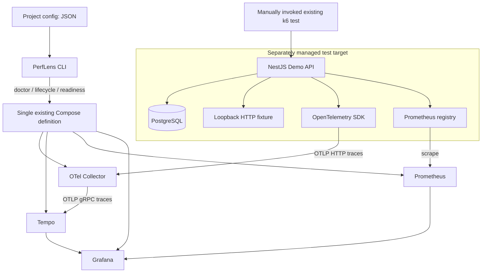
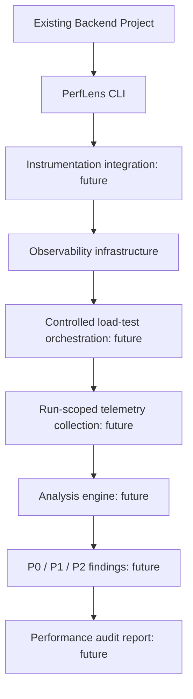

# PerfLens architecture

PerfLens is an installable Backend Performance Audit CLI / Developer Toolkit. This repository is its early, checkout-based foundation. The demo backend is a test target, not the product. The CLI currently controls infrastructure and validates project metadata; it does not instrument arbitrary applications or run audits.

## Current Phase 1 — implemented

### Boundaries

- `packages/cli` owns command orchestration, project validation, subprocess execution, diagnostics, and readiness checks. Commander parses arguments; reusable functions/services handle operations.
- `apps/demo-api` owns all NestJS/TypeORM code, migrations, synthetic seed data, and intentionally slow demo endpoints. The CLI does not import it, build it during `infra up`, or require it to probe infrastructure.
- `infra` and `docker-compose.yml` remain the only infrastructure definitions. No generated or duplicated Compose template is introduced.
- Metrics flow directly from the target to Prometheus. Tempo stores traces, not the application's Prometheus metrics.
- `.perflens/{runs,results,logs}` is a future artifact convention. `init` may create empty directories, but Phase 1 generates no report or audit result.

### Configuration and resolution

`perflens.config.json` contains `project.name`, `target.baseUrl`, and `observability.serviceName`. JSON avoids executable config and an extra parser dependency. Validation is deliberately strict, rejects unknown keys and embedded secrets, and permits only loopback target URLs. It is descriptive metadata in Phase 1, not a promise of arbitrary-project attachment.

Doctor finds project config in the current directory or its parents, or accepts `--config`. Infrastructure assets resolve relative to the CLI's checkout or explicit `--infra-dir`. This separates the target directory from the toolkit's infrastructure location. A future distributable will need an explicit infrastructure asset/version strategy; Phase 1 does not pretend to bundle or publish those assets.

`init` uses exclusive file creation and never overwrites existing configuration. It creates no instrumentation, dependency changes, Git edits, Docker changes, or framework guesses. All target integration remains explicit.

### Lifecycle and readiness

The infrastructure service allowlist is Collector, Tempo, Prometheus, and Grafana. `infra up` checks rendered Compose config and port conflicts, starts the allowlist using Compose health waits, then verifies service endpoints. The existing Prometheus image supplies `wget` for internal-network probes, avoiding a helper image or dependency on the demo.

`infra status` reports absent/stopped/running-not-ready/ready states and fails for crashed/unhealthy services. `infra down` uses `compose stop` only for the allowlist and verifies stopped states. It retains containers, networks, volumes, PostgreSQL, and target services. This deliberate meaning of `down` is documented in command help.

Doctor is read-only. Ports owned by the matching service in the selected Compose project count as correctly allocated; unrelated listeners are failures. The target API port and application health are separate from infrastructure readiness. Config rendering is never printed because it can contain `.env` credentials.

### Safety and network behavior

Shell-free Docker argument arrays, local Docker endpoint checks, loopback published-port checks, bounded process timeouts, and nonzero errors form the Phase 1 safety baseline. There are no automatic database operations, source changes, load tests, findings, or reports in the CLI. Target config cannot specify a remote URL or credentials.

Grafana and Tempo anonymous reporting is disabled. Grafana automatic preinstallation, plugin updates, update checks, and public-key downloads are disabled; required datasources are already bundled. Images and dependencies still require explicit registry downloads at installation/startup. These configuration guarantees are not a network firewall or a security review of third-party software.

## Future workflow — NOT IMPLEMENTED

Future commands may include `audit`, `analyze`, and `report`. Their services should consume validated target config and run artifacts, rather than NestJS controllers or demo-specific SQL. Language-specific instrumentation belongs behind explicit, separately tested integrations when that work is authorized. No Python/Java/Go/.NET adapter exists now.

The next architectural step is a controlled local run contract: explicit workloads, target authorization, run identifiers, captured environment/config metadata, cancellation, and failure handling. Analysis and reporting follow evidence collection; they are not hidden in the current infrastructure commands.
