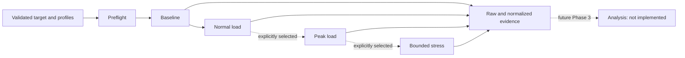

# Standardized audit execution — Phase 2

PerfLens is a Backend Performance Audit CLI / Developer Toolkit. This phase records **what happened under load**. It does not decide why, detect N+1, classify slow SQL, recommend indexes, rank findings, or generate reports. The demo's known fixtures are used in acceptance tests, never as diagnosis heuristics.



## Running an audit

Start local audit infrastructure with `pnpm perflens infra up`, then separately start your configured target. For this checkout's demo, use `docker compose up --build -d --wait demo-api`.

```sh
pnpm perflens audit                          # baseline + normal
pnpm perflens audit --profile baseline
pnpm perflens audit --profile normal
pnpm perflens audit --profile baseline,normal
pnpm perflens audit --profile peak,stress    # explicit local higher load
pnpm perflens --config /path/to/perflens.config.json audit
pnpm perflens runs
```

Select only workloads you are authorized to generate. Prefer isolated development/staging environments. This implementation preserves Phase 1's loopback-only target validation, including baseline. It does not support remote targets, a remote approval override, or automatic CI approval. A tunnel/proxy on localhost can still reach another system; loopback validation cannot infer authorization or prove environment isolation.

## Profiles and reproducible concurrency

| Profile | Purpose | Default VUs | Duration | Minimum start interval per VU |
| --- | --- | ---: | --- | ---: |
| baseline | Low-load latency reference | 1 | 10s | 500 ms |
| normal | Modest concurrent workload | 3 | 15s | 500 ms |
| peak | Explicitly selected higher workload | 6 | 15s | 500 ms |
| stress | Explicit, bounded pressure beyond the default peak | 10 | 15s | 500 ms |

These are conservative local demonstration settings, not claims about a client's normal or production load. Users choose relevant values based on their system. Overrides may change their relative intensity; profile names alone do not guarantee increasing traffic. Selection always executes in baseline/normal/peak/stress order, sequentially. Only selected profiles run; the default never includes peak or stress.

Each profile uses one k6 `constant-vus` scenario. Each VU issues one synchronous GET at a time; different VUs run concurrently. Configured endpoints are chosen round-robin across scenario iterations. After each request, the VU sleeps for the remaining `paceMs`. Thus the minimum request start spacing per VU is `paceMs`; slow responses lower achieved throughput. Approximate steady-state start-rate ceiling is `vus * 1000 / paceMs`, with an initial burst bounded by VUs. This is a closed concurrency model, not a fixed arrival-rate workload.

The original `load-tests/baseline.js` remains an independent five-VU smoke test. The CLI's packaged `packages/cli/assets/audit.js` implements the standardized profile contract and is copied into each run for reproducibility.

Hard limits, validated before starting a run:

- 1–50 VUs; 1–120 whole seconds per profile; 250–5000 ms minimum interval per VU.
- Request timeout 100–15000 ms; default 5000 ms. k6 graceful stop is timeout + pace + 1000 ms.
- Process deadline is profile duration + timeout + pace + 15000 ms. Expiry sends SIGINT, then SIGKILL after five seconds if necessary, and waits for child exit.
- At most four finite profiles and 1–8 distinct GET endpoints. No automatic escalation, infinite executor, redirects, or background test service.
- Exclusive project-directory lock prevents accidental overlapping CLI runs from multiplying load. Other projects/manual traffic are outside this lock.

## Configuration

Extend the existing JSON config with `audit`:

```json
{
  "project": { "name": "demo-api" },
  "target": { "baseUrl": "http://localhost:3002" },
  "observability": { "serviceName": "perflens-demo-api" },
  "audit": {
    "endpoints": [{ "method": "GET", "path": "/orders" }],
    "timeoutMs": 5000,
    "profiles": {
      "baseline": { "vus": 1, "duration": "10s", "paceMs": 500 },
      "normal": { "vus": 3, "duration": "15s", "paceMs": 500 },
      "peak": { "vus": 6, "duration": "15s", "paceMs": 500 },
      "stress": { "vus": 10, "duration": "15s", "paceMs": 500 }
    }
  }
}
```

Profiles and individual profile fields may be omitted to use defaults. `audit.endpoints` is required to audit; old configs without `audit` remain valid for existing commands. Unknown keys are rejected. Methods are explicit and currently GET only. Paths are absolute, up to 200 characters, restricted to letters/digits and `/._~-`, with no dot segments, query, fragment, or encoding. A base URL path prefix is retained when concatenating endpoints. No headers, auth, bodies, or credentials are accepted. New `init` configs use the generic localhost:3000 and GET `/`; review them explicitly before use.

Config discovery searches current directory and parents or uses `--config`. Artifacts and the lock live adjacent to that config, irrespective of the working directory. The fully resolved validated config is copied into the run. Config does not change Compose bindings, instrumentation, or scrape jobs.

## Preflight and failure semantics

Before load: validate config/selection, acquire the project lock, allocate a unique run, check host k6 2.3.x, check the existing local Compose services' real readiness, and GET every configured endpoint with a timeout. Each must return HTTP 2xx. Preflight requests carry the run header and profile `preflight`; they are not included in k6 summary metrics. Collector, Tempo, Prometheus, and Grafana must be ready, but readiness alone does not prove target instrumentation or ingestion.

The k6 adapter is deliberately verified against 2.3.x. Other versions fail early rather than silently normalizing a different format. It runs with a clean options config, an allowlisted process environment, local JSON output, and no cloud execution, dashboard, or usage reporting. Inherited `K6_*`, proxy, and secret variables cannot override the workload or output destination. No external script imports are used.

Run states: `created → preflight → running → completed`, or `failed`/`cancelled`. Selected profiles start as `created`, then `running`, and finish `completed`, `failed`, or `cancelled`; unstarted profiles remain `created` with null windows. Completed profiles remain intact if a later profile fails. Missing/inconsistent k6 evidence after exit 0 is an execution failure. There is no resume or rewrite of historical runs.

Exit 0 means measurement execution completed, not that performance was acceptable. Non-2xx and transport failures **during load** contribute to the measured error rate; they do not automatically impose a performance SLO. Preflight failures, nonzero k6 exit, process deadlines, or evidence failures return 1; invalid arguments/config return 2. Ctrl+C/SIGTERM asks the child to stop, preserves partial evidence, and returns 130. Missing measurements are null, not fabricated zeroes. A killed k6 process may not emit its final summary; available raw samples/logs still remain.

Invalid config/selection is rejected before allocation. Failures after allocation receive a stored failed run where the filesystem remains writable. No software can promise evidence persistence on a full/unwritable disk or finalization after SIGKILL/host crash. Hard interruption may leave `running` metadata and a stale `.perflens/audit.lock`; inspect processes before manually removing that lock. It is never automatically stolen. There is no hidden detached k6 process in normal completion/cancellation.

## Evidence contract

```text
.perflens/runs/pfl_<UTC timestamp>_<UUID>/
├── run.json                       # schemaVersion, identity, status, windows, errors
├── config.json                    # schemaVersion + resolved validated config
├── load-test.js                    # exact script used
├── k6-options.json                 # explicit empty k6 config
├── raw/
│   ├── engine.json                 # k6 version + script SHA-256
│   ├── <profile>.plan.json         # actual workload and target
│   ├── <profile>.execution.json    # exit code/signal/deadline/cancellation
│   ├── <profile>.summary.json      # untouched k6 handleSummary JSON
│   └── <profile>.samples.ndjson    # untouched k6 JSON metric points
├── results/<profile>.json          # normalized schemaVersion: 1
├── telemetry/metadata.json         # schemaVersion, run/profile windows, correlation
└── logs/<profile>.{stdout,stderr}.log
```

UUID-backed IDs and exclusive directory creation prevent reuse. State JSON is atomically replaced only while its run executes, then finalized. This is application-level historical immutability, not filesystem write protection against the owner. Newly created run directories are mode 0700; JSON/log files use 0600 where written by the CLI. `.perflens` is ignored by this repository. Other target repositories should ignore it explicitly.

Raw k6 JSON stays unchanged and is identified by the engine version. PerfLens-owned JSON documents use `schemaVersion: 1`; raw k6 formats have their own upstream contract. Normalized results include run/profile/status/timestamps, target endpoint list, effective workload, metric values, raw file references, and an interpretation boundary. Logs contain process diagnostics, not response body dumps. Partial runs may have only a subset of the listed files.

| Measurement | Meaning |
| --- | --- |
| requests / successfulRequests / failedRequests | k6 HTTP request count; success is HTTP 200–299; all other statuses/transport failures count as failed |
| errorRate | Failed requests divided by total requests, fraction 0–1 |
| rps | k6 `http_reqs` rate over its observed test duration, including completion/graceful-stop time |
| latencyMs | k6 HTTP duration: average, min, p50 (median), p90, p95, p99, max |
| durationMs | Actual k6 test duration; configured scenario duration and wall-clock profile start/end are also stored |
| statusDistribution | Counts by HTTP status; k6 status 0 can represent a transport failure |
| endpointRequests | Request counts by method/path |
| concurrency | Approximate client overlap calculated from raw request wall-time intervals, with sample count and source |

**Concurrency** is simultaneous work; VUs are concurrent virtual clients, which can be sleeping. **Throughput** is completed requests per second. **Latency** is a request's duration. p95 means 95% of measured request durations were at or below that percentile; a percentile from a short, low-count run is not a capacity guarantee. **Error rate** describes unsuccessful requests under this run's success definition. k6 HTTP duration excludes connection establishment; the custom wall-time interval used to verify overlap includes it. Latencies aggregate all configured endpoints; counts/status and raw tags permit later breakdowns.

The CLI does not infer bottlenecks from any of these metrics. A short audit with zero errors is not evidence of production readiness.

## Telemetry correlation

Every audit GET carries `X-PerfLens-Run-Id` and `X-PerfLens-Profile`. The demo's preloaded HTTP instrumentation validates and adds them only to incoming server spans as `perflens.audit.run_id` and `perflens.audit.profile`. It preserves the existing HTTP/pg instrumentations and OpenTelemetry propagation. It does not invent trace IDs, record arbitrary headers, or copy secrets. Querying the root span retrieves its trace with PostgreSQL and HTTP child spans.

Copy the ready-to-use query from `telemetry/metadata.json` into Grafana Explore → Tempo; use an absolute time range covering that run:

```traceql
{ resource.service.name = "perflens-demo-api" && span.perflens.audit.run_id = "<run-id>" }
```

Other target integrations must capture the same metadata explicitly; the CLI does not edit their source. The run ID remains useful in evidence even when a target is uninstrumented, but doctor/audit readiness does not claim that target's traces exist.

Prometheus correlation uses recorded UTC audit/profile windows plus target/service identity and local datasource URLs. No per-run label is added to application metrics. Windows may include other traffic; clocks and isolation matter. No Prometheus snapshot or full trace export is produced. The existing Tempo/Prometheus retention limits still apply (24 hours/seven days); run metadata does not extend retention. Preserve needed telemetry separately before investigating older evidence.

## Verifying real concurrent traffic

The k6 scenario records its constant-VU workload. Additionally, each request emits a wall-time measurement tagged by VU and endpoint; raw timestamps support an overlap sweep in normalized results. Millisecond rounding can obscure fast requests, so this is labeled an approximation.

For independent proof, the demo acceptance script `apps/demo-api/test/audit-telemetry.mjs` retrieves traces by run ID and compares server start/end nanoseconds. It requires overlapping server spans when `EXPECT_DEMOS=true`, and checks the known 21-query fixture, external HTTP parent-child structure, PostgreSQL spans, and Prometheus ingestion. This is a test of known fixtures, not a product analysis engine.

To exercise all fixtures, use an explicit config with GET `/orders`, `/performance/slow-query`, `/performance/n-plus-one`, and `/performance/external-call`. Keep concurrency/duration small; expensive intentional endpoints are not a production capacity model. See [actual verification](architecture/verification.md#phase-2--standardized-audit-execution--2026-09-30) for measured results, run IDs, and trace overlap proof.

## Boundary and references

Remote authorization flow, arrival-rate/saturation strategies, auth/body support, metric snapshots, trace exports, analytics, findings, reports, comparisons, and framework integrations are deferred. No Phase 3 logic is included.

The adapter uses k6's [constant-VUs executor](https://grafana.com/docs/k6/latest/using-k6/scenarios/executors/constant-vus/), [custom summary facility](https://grafana.com/docs/k6/latest/results-output/end-of-test/custom-summary/), and [JSON metric output](https://grafana.com/docs/k6/latest/results-output/real-time/json/). It does not parse human console output for performance measurements.
